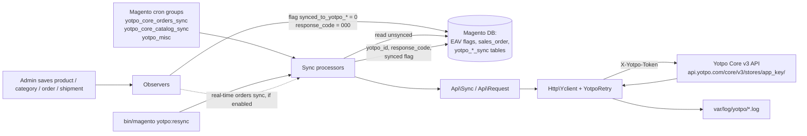
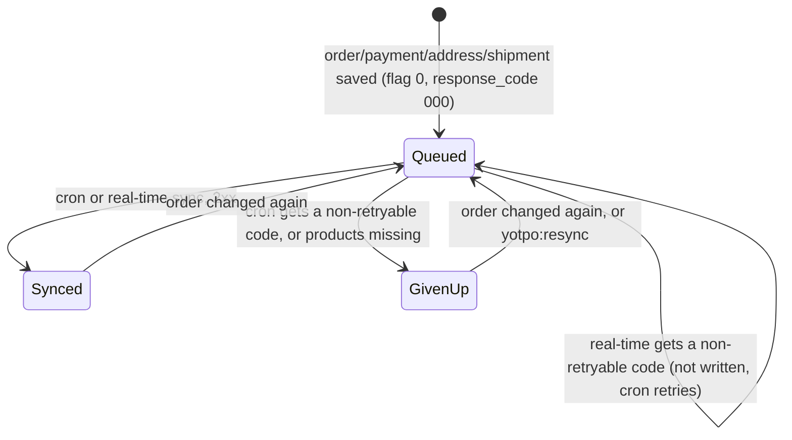
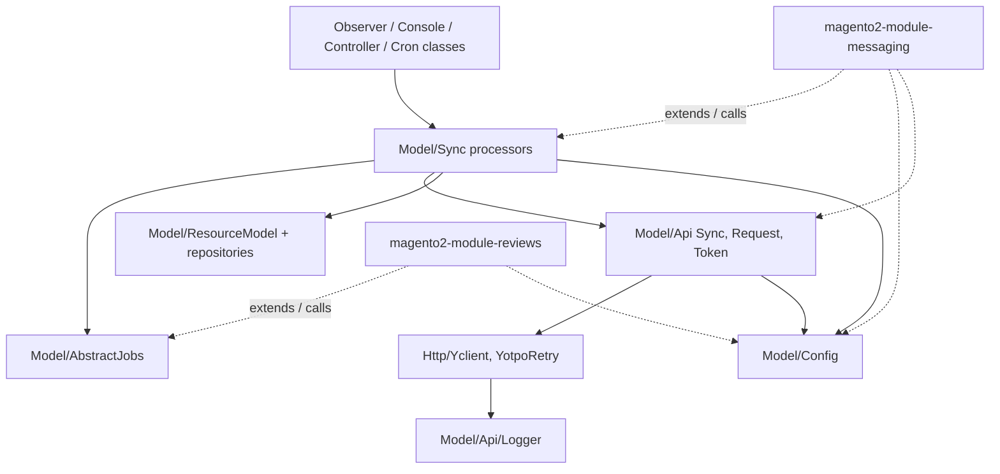

# Architecture

## System Overview
`Yotpo_Core` is a Magento 2 module that runs inside a merchant's store. It keeps a store's products, categories, category membership and orders in sync with Yotpo through the Yotpo Core v3 REST API (`etc/config.xml:14`) [1]. Observers mark changed entities as "not synced", Magento cron jobs push them in batches, and per-entity sync tables record Yotpo's ids and the last response code. The Reviews module and the SMS/Messaging module (`Yotpo_SmsBump`) build on this module's config, API client, logger and job base class. They ship as separate Composer packages that pin an exact core version [2].

## Module Map
One Magento module, `Yotpo_Core` (`etc/module.xml:3`), loaded after `Magento_Catalog`, `Magento_Sales` and `Magento_Customer` (`etc/module.xml:4-8`). Owner of every area: team Orbits (`CODEOWNERS`).

| Area | Responsibility | Key Files |
|------|---------------|-----------|
| Config | Config key → path map, API endpoints, response-code rules, store lists, encrypted secret and token | `Model/Config.php:76,93,464` |
| API client | Base URL + token header, invalid-token retry, HTTP call and logging, retry on 429/5xx | `Model/Api/Request.php:70`, `Model/Api/Token.php:64`, `Http/Yclient.php:84`, `Http/YotpoRetry.php` |
| Orders sync | Build order + fulfillment payloads, create/update orders in Yotpo, record results | `Model/Sync/Orders/Processor.php:118`, `Model/Sync/Orders/Data.php:141`, `Model/Sync/Orders/Main.php` |
| Catalog sync | Products and variants: create, update, delete, unassign | `Model/Sync/Catalog/Processor.php:132`, `Model/Sync/Catalog/Processor/Main.php`, `Model/Sync/Catalog/Data.php` |
| Category sync | Magento categories → Yotpo collections | `Model/Sync/Category/Processor/ProcessByCategory.php:95` |
| Collections products | Category membership of products → Yotpo collection products | `Model/Sync/CollectionsProducts/Processor.php:121` |
| Metadata | Daily platform/version metadata via the v1 API | `Model/Sync/Metadata/Processor.php:72` |
| Reset / retry | Clear sync tables and flags per store; CLI resync | `Model/Sync/Reset/Main.php:59`, `Console/Command/RetryYotpoSync.php:116`, `Console/Command/ResetYotpoSync.php:101` |
| Observers | Queue changed entities; react to admin config saves | `etc/events.xml`, `etc/adminhtml/events.xml`, `Observer/Config/Save.php:93` |
| Admin UI | Config fields, sync status, log download, reset orders sync | `etc/adminhtml/system.xml`, `Block/Adminhtml/**`, `Controller/Adminhtml/**`, `view/adminhtml/**` |
| Schema / setup | Sync tables and `sales_order` columns; EAV attributes and config migrations | `etc/db_schema.xml`, `Setup/Patch/Data/*.php` |
| Customers | Placeholder; the Messaging module provides the real customers sync | `Model/Sync/Customers/Processor.php:8` |

## Data Flow

Cron jobs and their schedules are in `etc/crontab.xml` (orders, products, categories, collections products read their `cron_expr` from config; metadata runs at `30 2 * * *`). The schedule defaults are `*/2 * * * *` (`etc/config.xml`, `orders_sync/frequency` and `catalog_sync/frequency`). Every cron group runs in a separate process (`etc/cron_groups.xml`).

### Order sync states
An order is tracked by `sales_order.synced_to_yotpo_order` (0 = queued, 1 = done or given up) and a `yotpo_orders_sync` row (`yotpo_id`, `response_code`, `is_fulfillment_based_on_shipment`) (`etc/db_schema.xml`).

Retry rules: `Config::canResync` (`Model/Config.php:464-490`) and `isNetworkRetriableResponse` (`:496`). The real-time rule is [ADR-0002](docs/adr/0002-cron-is-authoritative-for-order-sync.md).

## Key Abstractions
- **`AbstractJobs`**: base class for every processor. It gives store emulation (`emulateFrontendArea`, `Model/AbstractJobs.php:77`), bulk `insertOnDuplicate` / `update` (`:90,110`) and the one-immediate-retry bookkeeping (`:127-178`). The Reviews and Messaging modules extend it too.
- **`Model/Config`**: the only way to read or write module config. `getConfig('<key>')` resolves the key through `$config` (`Model/Config.php:93`); keys marked `encrypted` are decrypted, and `read_from_db` keys bypass the config cache (`:249`).
- **API request chain**: `Api\Sync::sync()` (`Model/Api/Sync.php:26`) → `Api\Request::send()` (`Model/Api/Request.php:70`) → `Http\Yclient::send()`. `Request` gets or creates the token (`:108`), adds `X-Yotpo-Token` and `X-Yotpo-User-Agent` (`:122`), and on an invalid-token response makes a new token and retries (`:93-97`). `Yclient` wraps every response in a `DataObject` with `status`, `is_success`, `reason`, `response`.
- **Sync flags**: EAV attributes `synced_to_yotpo_product` / `synced_to_yotpo_collection` (`Model/Config.php:24-25`, created by `Setup/Patch/Data/CreateProductAttribute.php` and `CreateCategoryAttribute.php`) and `sales_order.synced_to_yotpo_order` decide what cron picks up.
- **Entity loggers**: `Api\Logger` routes each request to `orders.log`, `catalog.log` or `general.log` by the `entityLog` key (`Model/Api/Sync.php:51-73`, `etc/di.xml`). `infoLog` writes only when `debug_mode_active` is on, which is the default (`Model/Logger/Main.php:49`, `etc/config.xml`).

## Extension Points
- **New synced entity**: a processor extending `AbstractJobs` under `Model/Sync/<Entity>/`, a cron class and a job in `etc/crontab.xml`, a config key for its schedule in `Model/Config.php:93` and `etc/adminhtml/system.xml`, a sync table in `etc/db_schema.xml` plus `etc/db_schema_whitelist.json`, an endpoint in `$endPoints` (`Model/Config.php:76`), and a log handler.
- **Queue on a new Magento event**: an observer in `Observer/<Area>/` registered in `etc/events.xml`. Keep it to bookkeeping; see the shipment observer for the real-time case (`Observer/Order/SalesOrderShipmentSaveAfter.php:60-95`).
- **New config setting**: `etc/adminhtml/system.xml`, default in `etc/config.xml`, key in `Model/Config.php:93`. React to a change in `Observer/Config/Save.php:93`.
- **Change existing data on upgrade**: a new class in `Setup/Patch/Data/`.
- **Customers / checkout sync**: lives in the Messaging module, which overrides the placeholder `Model/Sync/Customers/Processor.php`.

## Boundaries
- Only `Http/Yclient.php` (and `Model/Api/Token.php` through it) talks HTTP. Processors call `Model/Api/Sync`, never Guzzle.
- Observers only re-queue (flag + `response_code`) or, when real-time sync is on, call the processor. They must not do API work inside an open transaction (commit `48559fd`).
- This module must not require the Reviews or Messaging module. The few references to `Yotpo\SmsBump` classes are guarded by module checks or only used when that module is installed (`Model/System/Message/CustomSystemMessage.php:188`, `Controller/Adminhtml/Index/DownloadLogs.php:57-62`, `Console/Command/RetryYotpoSync.php:181`).
- Public classes used by the sibling modules (`AbstractJobs`, `Config`, `Api\Request`, `Api\Sync`, `Api\Logger`, `Logger\Main`, `Sync\Data\Main`, `Sync\Catalog\Processor`, `Sync\Reset`, `Helper\Data`, admin field blocks) are a cross-repo API: a changed signature breaks them at `setup:di:compile`.

## Dependency Graph

**Forbidden imports:**
- `Http/` and `Model/Api/` must not import `Model/Sync/*`. The client is shared by every processor and by the sibling modules; a reverse edge creates a cycle.
- `Model/Config` must not depend on any processor. Every class in this module and in both sibling modules injects it.

## Domain Ownership

| Domain | Owner | Models | Workers/Jobs | Key Invariants | Known Fragility |
|--------|-------|--------|--------------|----------------|-----------------|
| Orders | Orbits | `yotpo_orders_sync`, `sales_order.synced_to_yotpo_order`, `sales_order.yotpo_accepts_sms_marketing` | `yotpo_cron_core_orders_sync`; real-time via order observers | Only cron records a terminal failure ([ADR-0002](docs/adr/0002-cron-is-authoritative-for-order-sync.md)); `Orders\Data` state is reset per order | Shipment items are not written until the shipment transaction commits (commit `48559fd`); the fulfillment-flag pin (commits `a8b50eb`, `704ef13`) |
| Catalog | Orbits | `yotpo_product_sync`, `synced_to_yotpo_product` | `yotpo_cron_core_products_sync` | A 409 on create is recovered by GET + PATCH of the existing Yotpo id | Recovery depends on the real HTTP status surviving `Yclient` (commit `a4883e8`) |
| Collections | Orbits | `yotpo_category_sync`, `yotpo_collections_products_sync`, `synced_to_yotpo_collection` | `yotpo_cron_core_category_sync`, `yotpo_cron_core_collections_products_sync` | Unique per category/product and store (`etc/db_schema.xml`) | Store-scoped deletes in reset |
| Credentials & config | Orbits | `yotpo/settings/app_key`, encrypted `secret` and `auth_token` | `Observer/Config/Save` validates the key on save | A changed app key resets the store's credentials and sync (`Observer/Config/Save.php:139-214`) | Secret and token pass through the API logger (see [troubleshooting](docs/troubleshooting.md#security-notes)) |

## Cross-Domain Flows

### Order change → Yotpo
**Trigger:** `sales_order_payment_save_after`, `admin_sales_order_address_update`, `sales_order_shipment_save_after` (`etc/events.xml`).

**Execution Order:**
1. The observer re-queues the order: flag 0 and `response_code` `000` (`Observer/Order/OrderMain.php:67-104`).
2. If real-time sync is on for the store (`enable_real_time_sync`, default 0), it calls `Processor::processOrder` right away. The shipment observer defers this to the shipment's commit callback and de-duplicates per order (`Observer/Order/SalesOrderShipmentSaveAfter.php:79-95`).
3. Cron `processOrders` picks up every queued order per store, prepares shipment statuses, parent products, customer attributes and coupons in batch, then syncs each order (`Model/Sync/Orders/Processor.php:196-315`).
4. Orders with products Yotpo does not know trigger a product sync first (`checkMissingProducts`, `:606`).

**Failure Modes:** see [troubleshooting](docs/troubleshooting.md).

### Admin config save
**Trigger:** `admin_system_config_changed_section_yotpo_core` (`etc/adminhtml/events.xml`).

**Execution Order:** `Observer/Config/Save::execute` validates the app key and secret by requesting a token, then applies catalog attribute mapping, cron frequency and shipments-flag changes (`Observer/Config/Save.php:93-101`).

## Architectural Decisions
Index of ADRs (full records live in `docs/adr/`):

| ADR | Decision | Status |
|-----|----------|--------|
| [ADR-0001](docs/adr/0001-conflict-not-replace-for-legacy-package.md) | Declare `conflict` with the legacy `yotpo/module-yotpo` package instead of `replace` | Accepted |
| [ADR-0002](docs/adr/0002-cron-is-authoritative-for-order-sync.md) | Cron owns terminal order-sync results; real-time sync is best-effort and runs after commit | Accepted |

## Constraints
- **Compatibility:** PHP `^7.1|^8.0` and `magento/framework >=102.0.0` (`composer.json:8-11`); the supported Magento range is in `README.md:15-24`. Code must run on the oldest supported PHP (commits `052f291`, `4b2806f`, `bafe5ed`).
- **Release coupling:** Reviews and Messaging pin an exact core version, and the combined metapackage pins both. A core release is a coordinated multi-repo release (`README.md:68-87`).
- **Batch sizes:** orders 100 and products 100 per run, collections 10 (`etc/config.xml`, `orders_sync_limit`, `product_sync_limit`, `sync_limit_collections`); bulk SQL updates are chunked at 50 000 rows (`Model/Config.php:27`).
- **Marketplace:** Adobe runs MFTF suites on every Marketplace submission; a suite that includes no tests of this package makes MFTF run the whole Magento suite under it (commit `12b0aff`).

# Citations

[1] README.md — "the core files of the Yotpo Reviews & SMSBump extension" (`README.md:5`)
[2] README.md "Publish new version" and the sibling `composer.json` files — exact version pins across core, reviews, messaging and combined (`README.md:68-79`)
[3] Commit 3373ed8 "Stop replacing yotpo/module-yotpo; conflict with the legacy versions instead", 2026-09-15
[4] Commit 82e6ebd "fix(orders):don't let a real-time sync failure disable the cron fallback", 2026-08-28
[5] Commit 48559fd "fix(orders):defer real-time shipment sync until after commit", 2026-08-28
[6] Commit a3fe1da "fix(orders):scope line item product ids to the order being prepared", 2026-08-27
[7] Commit a4883e8 "fix(http): preserve real API status when Guzzle error message contains CR/LF", 2026-08-25
[8] Commit 12b0aff "Move yotpoDisableSuite to the reviews module", 2026-09-15
